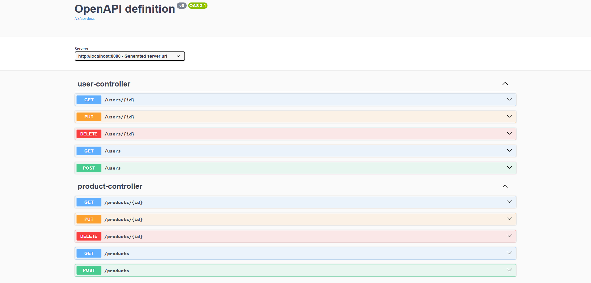

# DIO Java Spring Design Patterns

CRUD REST API proposed as a challenge by DIO to practice design patterns such as Singleton, Strategy and Facade.

## Project Improvements
- Use of DTOs
- Creating filters by specifications
- Use of table relationships

## Technologies
- [JDK 17.0.9](https://www.oracle.com/java/technologies/javase/jdk17-archive-downloads.html)
- [Spring Boot](https://spring.io/projects/spring-boot)
- [Spring MVC](https://docs.spring.io/spring-framework/reference/web/webmvc.html)
- [Spring Data JPA](https://spring.io/projects/spring-data-jpa)
- [PostgreSQL](https://www.postgresql.org/download/)

## How to Run
- Clone this repository:
```
https://github.com/matheusbloize/dio-java-spring-design-patterns.git
```
- Create your PostgreSQL database
- Create .env and add environment variables ([example](https://github.com/matheusbloize/dio-java-spring-design-patterns/blob/main/.env.example))
- Build project:
```
./mvnw clean package
```
- Run app:
```
java -jar target/dio-java-spring-design-patterns-0.0.1-SNAPSHOT.jar
```

### Links
API: 
- Users: [localhost:8080/users](http://localhost:8080/users)
- Products: [localhost:8080/products](http://localhost:8080/products)

Swagger UI: [localhost:8080/swagger-ui/index.html](http://localhost:8080/swagger-ui/index.html)

## API Endpoints
```
GET    /users  
GET    /users/{id}  
POST   /users  
PUT    /users/{id}  
DELETE /users/{id}

GET    /products  
GET    /products/{id}  
POST   /products  
PUT    /products/{id}  
DELETE /products/{id}
```

### Filters
```
GET    /products?sort=asc&userId=cf010c9d-2eb8-41f1-bae0-561d1847dcf2
GET    /products?sort=desc&priceLte=500&priceGte=250
GET    /products?offersExpiring=true
```


